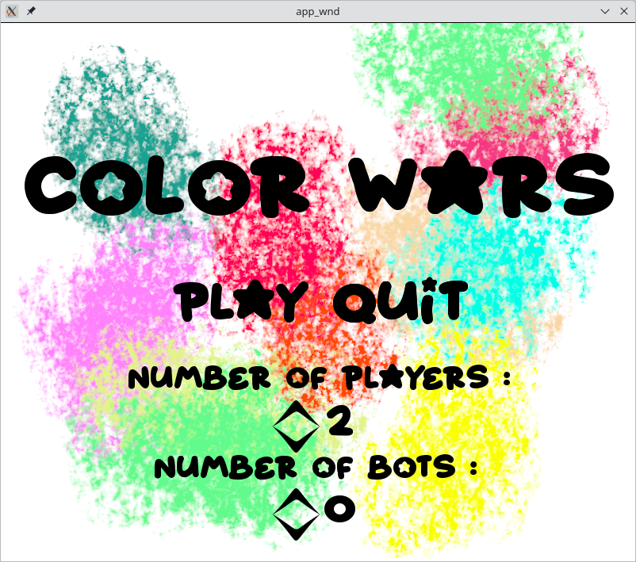

# Colorwars

## Description
This program is a simple video game where up to 4 players play agains one
another in an 8x8 table board of boxes. Said boxes may contain circles owned by
a specific players. When the game begins, players have no circles yet.
Therefore, they each click on an empty box, turn by turn, to place a first one.
At any given moment, the circles contain a given amount of points. Each turn, 
the players click on one of their circles to add a point. If a circle reaches 4 
points, it explodes, adding one point to horizontal and vertical neighbours and 
giving their ownership to the who owned the exploded cirlce. If a player loses 
his last circle, he's eliminated. The winner is the last player alive. It is
possible to have between 2 and 4 players. It is also possible to have a number
of bots equal or lower to the number of players. Since I've never implemented
such a feature in any previous project, it is actually the central focus of 
this project.

The main technology that was used is sdl2. The choice was mainly due to the
pre-existing knowledge i had. Moreover, the mai focus of this project, as
previously mentionned, is to experiment with the concept of bots. Consequently,
the game by itself isn't so complicated. Not only in the logic-wise, but also on
the graphic level. Hence, there was no necessity to find some super performant
frameworks or libs to handle the graphics.

## Dependencies

 * [SDL2](https://www.libsdl.org/)
 * [SDL2_image](https://wiki.libsdl.org/SDL2_image/FrontPage)
 * [Make](https://www.gnu.org/software/make/)

## Installation

To install the program, all you need to do is to make from the project
directory. Once it si done, the program colorwars will be created in the same
directory. Afterwards, make sure the program is executable. If it is not,
`chmod u+x ./colorwars` will give you the necessary permission.

## Execution

Once the insallation is done, all you need to do to run the program is run
`./colorwars` in the shell from the project directory.

### Menu Controls

The whole game is controled with the mouse. The menu should look something like
this.

The buttons are the following : *Play*, *Quit* and the different arrows.
You'll be able to know you're hovering a button by it's change. The *Play*
and *Quit* buttons will change color and the arrows will grow. Pressing
the left mouse button will do trigger the button.

### Game Controls

## Bot system

## Improvements

